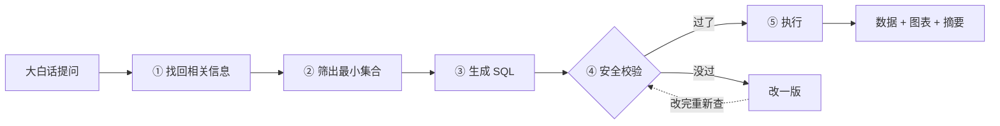

# 面试速记（口述版）

> 这版是**用嘴说的**，不是用眼看的。面试前十分钟翻一遍。
> 细节查 [`INTERVIEW.md`](INTERVIEW.md)，这份只负责让你**开口不卡壳**。

---

## 一、开场：30 秒，背下来

> 「我做的项目叫 rd-chatBI，一个 NL2SQL 平台。
> 业务同事用大白话提问，比如『目前有多少个未关闭的严重问题单』，
> 系统自己写 SQL、查库，返回数据表加图表。
>
> 核心就两件事：
> 第一，**让大模型看懂我们的表**——它本来不认识我们有哪些表、字段叫什么、指标怎么算；
> 第二，**大模型写出来的 SQL 不能全信**，得有代码把门。」

说完这两句就停，等对方问。**别主动展开。**

---

## 二、九步流水线：就记九个字

> ### 切　找　并　筛　补　写　查　改　跑

| 字 | 干嘛的 | 谁在干 |
|---|---|---|
| **切** | 把问题切词，抽出关键词 | jieba，纯 CPU，不要钱 |
| **找** | 找表、找字段、找指标、找枚举值、找相似示例 | 四路同时找（见下） |
| **并** | 把四路结果合并成一张完整表结构 | 查 PG 元数据 |
| **筛** | 让大模型从候选里挑出**最小**集合 | LLM，省 token |
| **补** | 补上今天是几号、数据库版本 | 纯计算 |
| **写** | 让大模型写 SQL | LLM |
| **查** | **安全校验** + 让数据库 EXPLAIN 试一下 | 代码，不是 LLM |
| **改** | 报错了让大模型改一版（只给一次机会） | LLM |
| **跑** | 只读事务执行，加行级权限，删敏感列 | 数据库 |

**记忆钩子**：前四步「**备料**」→ 中间两步「**动手**」→ 后三步「**验货交货**」。

- 备料：切、找、并、筛 —— 把该用到的表字段指标凑齐
- 动手：补、写 —— 补上下文、写出 SQL
- 验货交货：查、改、跑 —— **安全校验在这儿**，过了才执行

---

## 三、四路召回：记一句话

> 查数据无非搞清楚四件事：**查哪些列？值长什么样？口径怎么算？以前怎么问的？**

- **查哪些列** → 走向量检索（Milvus），因为列名是语义匹配
- **值长什么样** → 走 Elasticsearch 全文检索，因为「未关闭」「critical」是精确字面量，向量检索反而不准
- **口径怎么算** → 也走向量（Milvus），指标定义是业务语言
- **以前怎么问的** → 还是向量（Milvus），把评测集的标准答案和审核过的 badcase 建成示例库，生成前先找几条相似问题当参考（few-shot）

**为什么是三个库不是一个大杂烩**：东西的性质不一样，就该用不一样的存储。示例库和列/指标都是向量，但**用途不同**——前三个解决「查哪」，示例解决「怎么查」。

---

## 四、四层防线：记八个字

> ### 看不见　拦得住　捞得回　兜得底

| 口诀 | 第几层 | 一句话 |
|---|---|---|
| **看不见** | Prompt | 敏感列**压根不写进元数据**，大模型不知道有这东西 |
| **拦得住** | AST 校验 | sqlglot 真解析成语法树：只准 SELECT、只准一条、`LIMIT` 强制压到 100、危险函数拉黑 |
| **捞得回** | 执行层 | `SELECT *` 会绕过上面两层（没有列名可查），所以**结果出来先删敏感列**，再给用户和摘要模型 |
| **兜得底** | 数据库 | 只读账号，前三层全被绕过也写不进删不掉 |

**为什么第四层前面还有三层**：只读账号挡得住"改数据"，挡不住"偷看数据"。

---

## 五、数字阶梯：9 - 4 - 4 - 2 - 1

> 对方问「能概括一下吗」，报这串数字。

- **9** 步流水线
- **4** 层安全防线
- **4** 路并行召回
- **2** 组并行（召回一组、过滤一组）
- **1** 轮纠错（改完必须重新过校验，只给一次机会）

**1 那个要说清楚**：「改错了也是大模型写的，不能因为它是改出来的就直接执行，得回去重新检查。」

---

## 六、听不懂时掏出来的类比

想不起来术语，就说这个：

| 概念 | 怎么说 |
|---|---|
| 为什么要有召回 | 大模型不认识我们公司的表。**就像让一个没来过你家的人找东西**，你得先告诉他东西大概在哪个柜子，不能把整个家翻一遍。 |
| 为什么四路并行 | 找东西的四条线索互不相干，**没道理排队做**。 |
| 为什么执行前要 EXPLAIN | 相当于**先让数据库"读一遍"**，不真跑。语法错、列名错立刻发现，不花数据成本。 |
| 行级权限 | 工程师只能看自己负责的域。**不问 SQL 写了什么，一律再 AND 一个条件上去**——因为用户能诱导大模型写出任意责任域。 |
| 连接池 | 查一次库像打一通电话。原来是**每次拨号、通话、挂断**；现在每部电话机**常备几条线路**，打完不挂。 |
| 熔断器 | **家里的空气开关**。大模型服务商挂了，连续失败五次就跳闸，后面的请求毫秒级返回「稍后重试」，不再去敲那扇已经坏了的门。 |
| Redis 存对话 | 服务员的记事本，原来是**各自揣兜里**（换个服务员就不知道你刚才问了啥），现在**放到门口公共柜**，谁接待都能翻。 |

---

## 七、高频追问：一句话答

**问：为什么用 LangGraph，不用 Agent？**
> 「流程是**死的**——先召回、再过滤、再生成，每一步都定好了。让 AI 现场决定调哪个工具，反而不可控、也没法测。」

**问：`SELECT *` 怎么防？泄密了怎么办？**
> 「两头堵。**元数据里就没有这列**，大模型不知道；万一它写 `SELECT *`，**结果出来先删掉敏感列**，再给用户和摘要模型。」

**问：`LIMIT` 为什么要用 AST，字符串判断不行吗？**
> 「字符串判断有三个洞：写 `LIMIT 99999999` 照样拖库；列名碰巧叫 `limit` 会误判；末尾加个 `--` 注释，补的 LIMIT 直接被吞掉。」

**问：大模型写错了怎么办？**
> 「三步。**先 EXPLAIN 试**，不真跑，语法列名错立刻发现；**错了让大模型改**，只给一次；**改完必须重新过校验**，而且原始报错只进日志，不返回给用户——错误文本会暴露表结构。」

**问：怎么保证改了代码不出问题？**
> 「**232 道评测题进 CI**，其中离线那道门禁是纯函数、不连库：每条标准答案的 SQL 必须先过安全层——它被拒就两种可能，要么题目写错，要么**安全层误伤了合法查询**，两种都得拦在合并前。」

**问：并发上有什么考虑？**
> 「限流走 Redis 滑动窗口，跨进程；连接池按事件循环分区，每条连接不跨循环用；大模型调用有熔断；SSE 一旦客户端断开就取消任务，**不然剩下的几次大模型调用会全跑完，白烧钱**。」

---

## 八、主动认怂（加分项，一定要说）

说完优点，自己接一句：

> 「有几个还没做的：
> 一是数据库连接串**明文放在配置里**，生产要接密钥管理；
> 二是业务库改了表结构，元数据**不会自动跟进**，现在得手动重跑构建；
> 三是图表类型是模型单次推荐的，**没有规则兜底**，可能出现分类太多还画饼图；
> 四是判分器的数值容差挡不住模型主动 `ROUND()`——一个增长率题模型输出 `0.05`、标准答案 `0.04921`，还是判错。这条我还没定怎么修。」

**说得出局限，比说得出优点更让人信。**

### 8.1 更强的一条：讲「我发现我的评测判分器本身是错的」（★ 优先讲这条）

上面三条是**配置类**局限，做过一版 demo 的人都能说。下面这条是**度量类**局限，能讲住面试官：

> 「跑实况评测时，**明细查询一类 6 题全军覆没，0%**。我以为是大模型不会写明细 SQL，下钻到数据库才发现是**我的判分器在问一个没有唯一答案的问题**：
>
> 一题是『最近 10 条致命缺陷』——实际有 4000 行候选，**最新时间戳上并列 11 行**，golden 只取 10，哪 10 条是任意的。另一题 golden 干脆**没有 ORDER BY 却写了 LIMIT 20**，而系统侧安全层会把 LIMIT 钳到 100，两边拿两个合法子集互比。
>
> 更麻烦的是**判分器和被测系统口径不一致**：golden 跑的是未经钳制的原始 SQL，模型跑的是钳制过的——有一条 golden 返回 336 行，而系统最多 100 行，**它自己都过不了自己的门禁**。
>
> 我改成三态判定：完全相等算过，构成真子集关系判**无唯一答案、不计分**，其余才算错。关键是不能宽松成『有重叠就放过』——我写了条测试钉住：`[0..9]` 和 `[5..14]` 有交集但互不包含，**必须判错**。另外给离线门禁加了案例 lint，专门点名『带 LIMIT 却没 ORDER BY』的题，实测命中 4 条。
>
> **但这还没完。**改完拿真模型重跑，我又发现判分器在**挑模型的输出格式**：
>
> 一题是『上月和上上月充电次数差多少』——golden 只返回一个差值 `0`，模型返回了三列（上月 7728、上上月 7728、差值 0），**数值全对**，但被判错。根因是我的判分器把一行里的值排序成一个元组，**丢掉了列结构**，模型多给一列就判不等。改成逐行一对一匹配、按列值子集比较（列名不参与，模型的别名和标准答案不同是常态）。
>
> 另一题是『今年以来每月交付量』——9 个月的计数**逐个相同**，唯一差异是 golden 返回 `datetime`、模型返回 `'2026-01'` 字符串。`str(datetime)` 是 `2026-01-01 00:00:00+00:00`，跟 `'2026-01'` 不相等。**模型把月份格式化得更规范，反而被判错。**加了日期等价归一化，边界卡得很紧：只有带时间部分的 TIMESTAMP 零点才归到月，纯 `'2026-01-01'` 不缩（那是 DATE 列的形态，缩了会把「1 月 1 日」和「整个 1 月」混掉）。
>
> **五类问题修完，同一套模型从 59% 涨到 78%**——那 19 个点里大部分不是模型变强，是判分器不再挑格式了（明细 0%→50%、排序 TopN 33%→67%、easy 73%→100%）。
>
> **所以我最想说的一句是：我怀疑我自己报过的每一个准确率数字。**」

**为什么这条强**：它同时证明三件事——① 我有能发现它的测试 ② 我会下钻找真因而不是甩锅给模型 ③ **我怀疑自己的度量**。绝大多数候选人只会报一个准确率数字，不会说「我怀疑我这个数字」。

### 8.2 分层门禁（对方追问「下一步呢」时答）

> 「**分层门限补上了**。原来只有一个总分门限，而总分里单表聚合和分组统计都是 100%、**明细查询是 0%**——只看总分等于没看见。现在按『数据源 × 类别』各自设门限，**首版一律要求 100% 不放宽**：先把哪一类漏水变成 CI 里可见的事实，而不是调低门限让它变绿。」
>
> 「立的时候还踩了个坑：第一版我用排除法挑『类别』键，结果 **easy / medium / hard 全被当成类别**，按 100% 报了一堆假失败——英文难度键里没有 `/`，排除法挡不住。改成从案例文件读真实类别名的**正面白名单**。」
>
> 「还没做的是**把这几类修上去**（多表 JOIN 71% / 排序 TopN 67% / 时间窗口 78% / 明细 50%），以及给明细类的 golden 补唯一 tie-breaker。」

**别主动提 P1 检索 Agent 化 / 语义层 DSL**：按当前判分口径，这两个拿不到**可归因**的收益（收益会被判分噪声吃掉）。如果对方问到，就说「在做之前我先把度量修准，否则 A/B 没有意义」——这是加分答法。

---

## 九、最后：白板上画什么

**只画这条线，别画细节：**

画完嘴上补一句：

> 「**九步**都在这条线上。
> 右边那两个红黄框是重点：**校验是代码在做，不是大模型**；
> **执行前还得再套一层行级权限**，工程师只能看自己负责的域。」

---

## 十、如果只剩三分钟

背这四句就够：

1. 「**NL2SQL 平台**，大白话查库，自动出图表。」
2. 「**切找并筛补写查改跑**，九步。」
3. 「**看不见、拦得住、捞得回、兜得底**，四层防线。」
4. 「**232 道评测题进了 CI**，改代码会红。」
