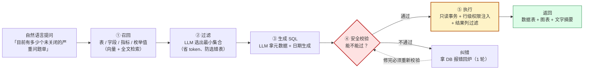
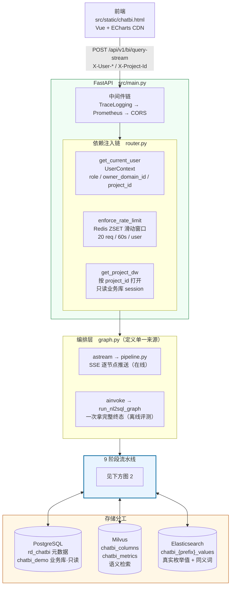
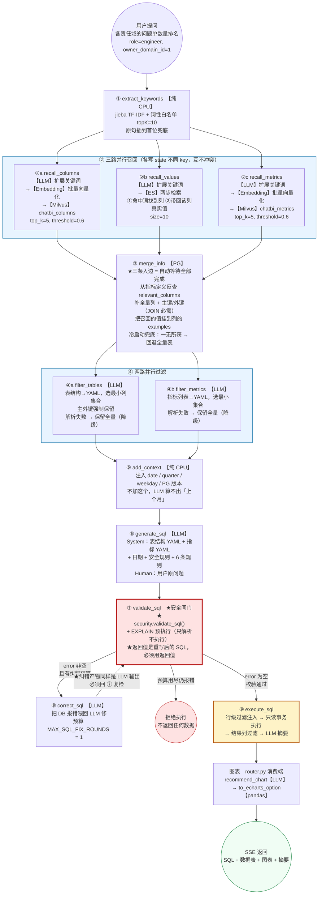
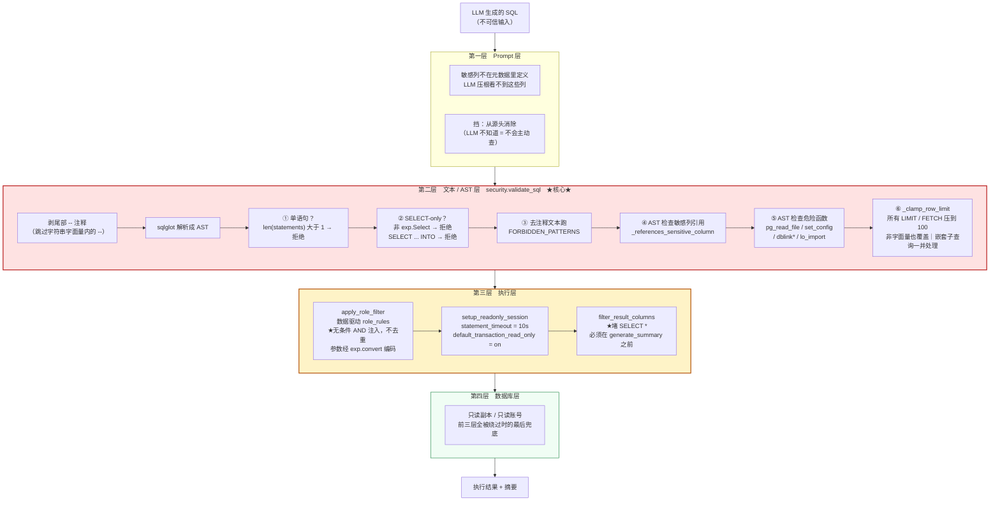
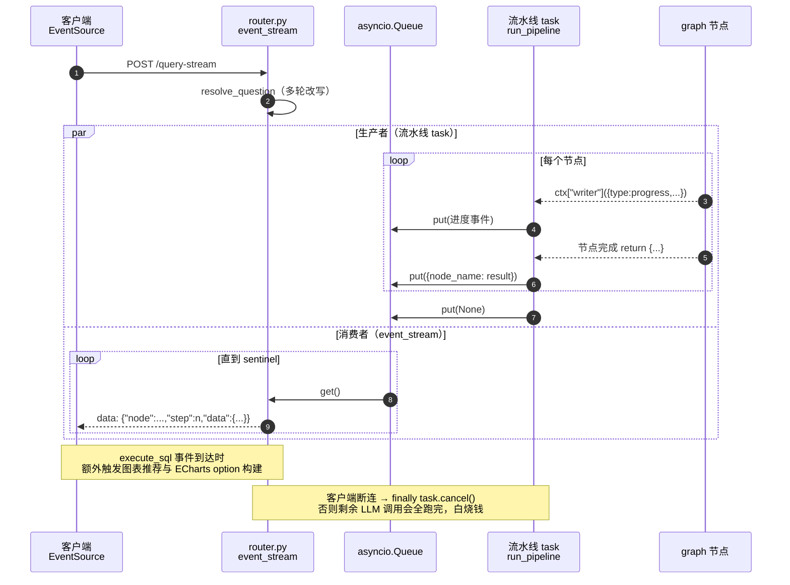

# rd-chatBI 架构图
> 本文件只放 Mermaid 源码，便于 GitHub / GitLab / Obsidian / mermaid.live 直接渲染。
> 讲稿正文见 [`../INTERVIEW.md`](../INTERVIEW.md)。
>
> **本地直接看图**：打开 [`architecture.html`](architecture.html)（浏览器渲染，可导出 PNG）。
> **可打印 HTML 版**：[architecture_print.html](architecture_print.html)（由本文件生成）；
> **已导出的图片**：[`png/fig0.png`](png/fig0.png)（总览）~ [`png/fig4.png`](png/fig4.png)，
> 由 `mmdc`（mermaid-cli）从本文件的代码块生成，`-s 2` 即 2 倍分辨率：
> ```bash
> npx @mermaid-js/mermaid-cli -i figN.mmd -o figN.png -b white -s 2 \
>   -p puppeteer.json -c mermaid-theme.json   # 配色必须传，否则用内置低对比主题
> ```

## 图 0 — 一句话总览（先看这张，再看细节）



> 记住这一条线，细节都是它的展开：**召回 → 过滤 → 生成 → 校验 →（纠错）→ 执行**。
> 下面三张图分别是：架构全景、流水线细节、安全防线细节。

## 图 1 — 整体架构（请求链路 + 存储分工）


## 图 2 — 9 阶段流水线主干（并行 / 条件 / 回环）


## 图 3 — 四层 SQL 安全防线（数据在每层被拦什么）


## 图 4 — SSE 事件流（queue 桥接）

